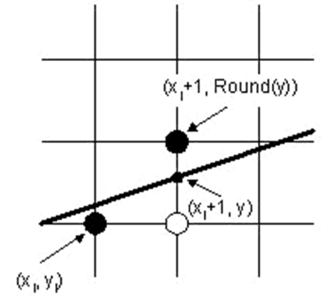

<!-- Banner -->

  

<h1 align="center"><b>ĐỒ HOẠ MÁY TÍNH</b></h>

## THÀNH VIÊN NHÓM
| STT    | MSSV          | Họ và Tên              |Chức Vụ    | Github                                                  | Email                   |
| ------ |:-------------:| ----------------------:|----------:|--------------------------------------------------------:|-------------------------:
| 1      | 19521676      | Đỗ Trọng Khánh         |Nhóm trưởng|[trong-khanh-1109](https://github.com/trong-khanh-1109)  |19521676@gm.uit.edu.vn   |
| 2      | 19521383      | Võ Phạm Duy Đức        |Thành viên |[ducducqn123](https://github.com/ducducqn123)            |19521383@gm.uit.edu.vn   |

## GIỚI THIỆU MÔN HỌC
* **Tên môn học:** Đồ hoạ máy tính
* **Mã môn học:** CS105
* **Mã lớp:** CS105.M11.KHCL
* **Năm học:** HK1 (2021 - 2022)
* **Giảng viên**: ThS.Cáp Phạm Đình Thăng

## QUÁ TRÌNH
### Week 1: CÁC THUẬT TOÁN VẼ ĐƯỜNG THẲNG
#### 1. Thuật toán Digital differential analyzer (DDA)
  - Phương trình đường thẳng: `y = m.x + b`. 
   
  - Để đơn giản hóa giải thuật ta xét đường thẳng với `min [0,1] , Dx > 0`
  - Tại mỗi bước ta cho `X` tăng lên 1 đơn vị tức là `Xi+1 = Xi + 1 => Yi+1 = Yi + m`
  - Do `m` là số thực nên muốn `Yi+1` là số nguyên ta phải làm tròn trước khi truy xuất tọa độ để đưa ra màn hình.
  - Với đường thẳng có `m > 1` ta sẽ làm ngược lại cho `Y` biến thiên và tính `X` theo `Y` nghĩa là tại mỗi bước ta có Yi+1 = Yi + 1 => Xi+1 = Xi + m
  - Với các đoạn thẳng có `Dx <0` ta sẽ cho `X` giảm xuống chứ không tăng. 
  

 
#### 2. Thuật toán Bresenham

<!-- Footer -->

© Copyright by Đỗ Trọng Khánh

